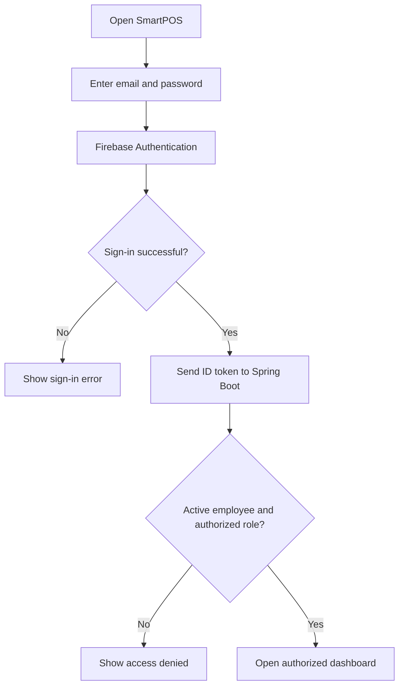
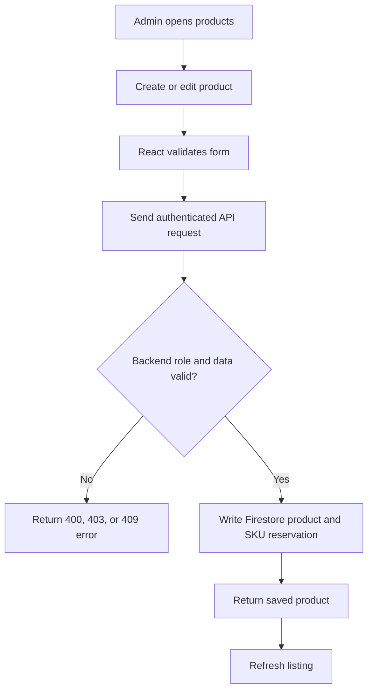
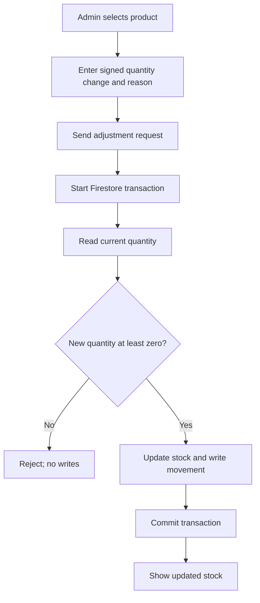
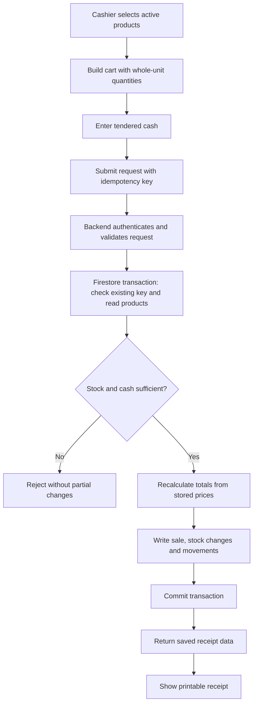

# SmartPOS — Business Workflows

These represent intended behavior, not yet implemented code.

## 1. Employee Sign-In

## 2. Product Maintenance (Admin)

Use a backend-owned uniqueness mechanism for SKU. Product deactivation retains historic sales.

## 3. Manual Stock Adjustment (Admin)

## 4. Cash Sale Checkout

### Idempotency and retries
- A unique idempotency key is generated **once per checkout attempt**.
- A retry with the same key and identical payload returns the original sale; differing payload for that key is rejected.
- The backend must enforce this atomically; disabling the button alone is insufficient.
- If the network breaks after submission, the UI must not assert failure or success prematurely. Retry safely with the same key to determine the outcome.
- Firestore transaction callbacks can retry, so do not send emails, print or invoke external payment APIs inside them.

### Concurrent checkout example
For one remaining item, two cashiers submit a sale simultaneously. The transaction mechanism must allow at most one successful decrement; the other receives an insufficient-stock or retry failure. No negative quantity is allowed.

## 5. Receipt and Sales History
1. Completed sale has a receipt ID, stored line-item name/price snapshots, timestamps and cashier UID.
2. Authorized user opens own receipt; Admin may open any receipt.
3. Receipt is displayed as printable HTML; browser print dialog handles printing.
4. Sales history supports bounded queries / pagination and uses the authorized user scope.

## 6. Admin Daily Summary
1. Admin selects a business date.
2. Backend computes correct UTC interval for the configured store timezone.
3. Query completed sales in that interval.
4. Return count and total in integer minor units; frontend formats currency.
5. Confirm totals against a small known dataset. For large volumes, later add aggregations.

## 7. Errors to Handle
| Situation | Expected behavior |
|---|---|
| Wrong login | Generic authentication error; no data access. |
| Cashier requests admin API | HTTP 403; no update. |
| Duplicate SKU | HTTP 409; no second product. |
| Invalid product quantity/price | HTTP 400; clear field error. |
| Insufficient stock | Checkout rejected; no sale or stock write. |
| Cash tendered below payable | Checkout rejected; no sale. |
| Duplicate checkout retry | Original sale result returned when matching. |
| Temporary network failure | Safe retry with same key; avoid false success notices. |

## 8. Manual Demo Script
1. Log in as Admin and create a product with stock 10.
2. Adjust stock by +5; verify stock movement and quantity 15.
3. Log in as Cashier and sell quantity 2.
4. Verify receipt, saved sale, and stock quantity 13.
5. Replay checkout key and confirm quantity stays 13.
6. Attempt to sell 14; confirm rejection with stock unchanged.
7. Log in as Admin and verify daily sales summary.
8. Confirm Cashier cannot edit products.